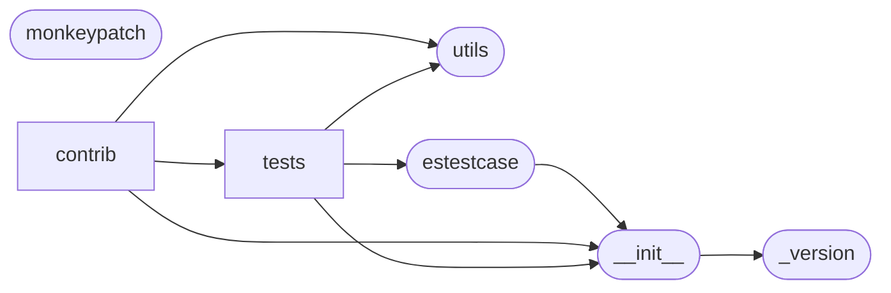

# Code Overview

[_Documentation generated by Documatic_](https://www.documatic.com)

<!---Documatic-section-Codebase Structure Python-start--->
## Codebase Structure Python

The codebase has a 3-deep folder structure,
                with 24 code files in total.

<!---Documatic-block-system_architecture-start--->

<!---Documatic-block-system_architecture-end--->

# #
<!---Documatic-section-Codebase Structure Python-end--->

<!---Documatic-section-Key Objects-start--->
## Key Objects

There are exposed imports at level-0
from the source directory (elasticutils)

<!---Documatic-block-elasticutils-start--->

	
<code>elasticutils</code> (Click to Expand!)

* `elasticutils._version.__version__`

<!---Documatic-block-elasticutils-end--->

# #
<!---Documatic-section-Key Objects-end--->

<!---Documatic-section-Important Functions-start--->
## Important Functions

<!---Documatic-block-important_funcs-start--->
<!---Documatic-block-most_used_funcs-start--->
### Most Utilised Functions

* elasticutils.__init__.get_es (4 times)
* [elasticutils.utils.chunked](3-elasticutils_utils.md#elasticutils.utils.chunked) (2 times)
* [elasticutils.tests.__init__.facet_counts_dict](6-elasticutils_tests.md#elasticutils.tests.__init__.facet_counts_dict) (2 times)
* [elasticutils.contrib.django.__init__.get_es](5-elasticutils_contrib.md#elasticutils.contrib.django.__init__.get_es) (2 times)
* [elasticutils.contrib.django.tests.__init__.reset_model_cache](5-elasticutils_contrib.md#elasticutils.contrib.django.tests.__init__.reset_model_cache) (2 times)
* elasticutils._version.__version__ (1 times)
* [elasticutils.contrib.django.tasks.index_objects](5-elasticutils_contrib.md#elasticutils.contrib.django.tasks.index_objects) (1 times)
* [elasticutils.contrib.django.tasks.unindex_objects](5-elasticutils_contrib.md#elasticutils.contrib.django.tasks.unindex_objects) (1 times)
* [elasticutils.utils.to_json](3-elasticutils_utils.md#elasticutils.utils.to_json) (1 times)
* [elasticutils.tests.__init__.require_version](6-elasticutils_tests.md#elasticutils.tests.__init__.require_version) (1 times)
<!---Documatic-block-most_used_funcs-end--->

<!---Documatic-block-end_user_funcs-start--->
### End User Exposed Functions

* elasticutils._version.__version__
* elasticutils.__init__.get_es
* elasticutils.__init__.split_field_action
* elasticutils.__init__.decorate_with_metadata
* elasticutils.__init__.ElasticUtilsError
* elasticutils.__init__.InvalidFieldActionError
* elasticutils.__init__.InvalidFlagsError
* elasticutils.__init__.InvalidFacetType
* elasticutils.__init__.BadSearch
* elasticutils.__init__.FacetResult
* elasticutils.__init__.F
* elasticutils.__init__.Q
* elasticutils.__init__.PythonMixin
* elasticutils.__init__.S
* elasticutils.__init__.MLT
* elasticutils.__init__.SearchResults
* elasticutils.__init__.DictResult
* elasticutils.__init__.TupleResult
* elasticutils.__init__.DictSearchResults
* elasticutils.__init__.ListSearchResults
* elasticutils.__init__.ObjectSearchResults
* elasticutils.__init__.Metadata
* elasticutils.__init__.NoModelError
* elasticutils.__init__.MappingType
* elasticutils.__init__.DefaultMappingType
* elasticutils.__init__.Indexable
<!---Documatic-block-end_user_funcs-end--->
<!---Documatic-block-important_funcs-end--->

# #
<!---Documatic-section-Important Functions-end--->

<!---Documatic-section-File IO-start--->
## File IO

<!---Documatic-block-file_io-start--->
The following files have file write operations

<!---Documatic-block-elasticutils.tests-start--->

	
<code>elasticutils.tests</code> (Click to Expand!)

* elasticutils.tests.test_utility_functions

<!---Documatic-block-elasticutils.tests-end--->
<!---Documatic-block-file_io-end--->

# #
<!---Documatic-section-File IO-end--->

<!---Documatic-section-Class Hierarchy-start--->
## Class Hierarchy

<!---Documatic-block-BaseIndexable-start--->

	
<code>BaseIndexable</code> (Click to Expand!)

* elasticutils.contrib.django.__init__.Indexable

<!---Documatic-block-BaseIndexable-end--->

<!---Documatic-block-ElasticUtilsError-start--->

	
<code>ElasticUtilsError</code> (Click to Expand!)

* elasticutils.__init__.BadSearch
* elasticutils.__init__.InvalidFacetType
* elasticutils.__init__.InvalidFieldActionError
* elasticutils.__init__.InvalidFlagsError

<!---Documatic-block-ElasticUtilsError-end--->

<!---Documatic-block-PythonMixin-start--->

	
<code>PythonMixin</code> (Click to Expand!)

* elasticutils.__init__.MLT
* elasticutils.__init__.S

<!---Documatic-block-PythonMixin-end--->

<!---Documatic-block-elasticutils.__init__.DefaultMappingType-start--->

	
<code>elasticutils.__init__.DefaultMappingType</code> (Click to Expand!)

* elasticutils.__init__.DefaultMappingType
* elasticutils.contrib.django.tests.__init__.FakeDjangoMappingType
* elasticutils.tests.test_query.FakeMappingType
* elasticutils.tests.test_results.FakeMappingType
* elasticutils.tests.test_types.FakeMappingType

<!---Documatic-block-elasticutils.__init__.DefaultMappingType-end--->

<!---Documatic-block-elasticutils.__init__.DictSearchResults-start--->

	
<code>elasticutils.__init__.DictSearchResults</code> (Click to Expand!)

* elasticutils.__init__.DictSearchResults
* elasticutils.__init__.ListSearchResults
* elasticutils.__init__.ObjectSearchResults

<!---Documatic-block-elasticutils.__init__.DictSearchResults-end--->

<!---Documatic-block-elasticutils.contrib.django.__init__.Indexable-start--->

	
<code>elasticutils.contrib.django.__init__.Indexable</code> (Click to Expand!)

* elasticutils.contrib.django.tests.__init__.FakeDjangoMappingType
* elasticutils.tests.test_types.FakeMappingType

<!---Documatic-block-elasticutils.contrib.django.__init__.Indexable-end--->

# #
<!---Documatic-section-Class Hierarchy-end--->

[_Documentation generated by Documatic_](https://www.documatic.com)