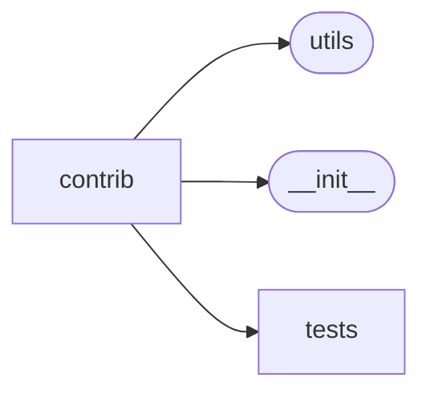

# Elasticutils Contrib

[_Documentation generated by Documatic_](https://www.documatic.com)

<!---Documatic-section-Codebase Structure-start--->
## Codebase Structure

<!---Documatic-block-system_architecture-start--->

<!---Documatic-block-system_architecture-end--->

# #
<!---Documatic-section-Codebase Structure-end--->

<!---Documatic-section-elasticutils.contrib.django.__init__.get_es-start--->
## [elasticutils.contrib.django.__init__.get_es](5-elasticutils_contrib.md#elasticutils.contrib.django.__init__.get_es)

<!---Documatic-section-get_es-start--->
<!---Documatic-block-elasticutils.contrib.django.__init__.get_es-start--->
<details>
	<summary><code>elasticutils.contrib.django.__init__.get_es</code> code snippet</summary>

```python
def get_es(**overrides):
    defaults = {'urls': settings.ES_URLS, 'timeout': getattr(settings, 'ES_TIMEOUT', 5)}
    defaults.update(overrides)
    return base_get_es(**defaults)
```
</details>
<!---Documatic-block-elasticutils.contrib.django.__init__.get_es-end--->
<!---Documatic-section-get_es-end--->

# #
<!---Documatic-section-elasticutils.contrib.django.__init__.get_es-end--->

<!---Documatic-section-elasticutils.contrib.django.tests.__init__.reset_model_cache-start--->
## [elasticutils.contrib.django.tests.__init__.reset_model_cache](5-elasticutils_contrib.md#elasticutils.contrib.django.tests.__init__.reset_model_cache)

<!---Documatic-section-reset_model_cache-start--->
<!---Documatic-block-elasticutils.contrib.django.tests.__init__.reset_model_cache-start--->
<details>
	<summary><code>elasticutils.contrib.django.tests.__init__.reset_model_cache</code> code snippet</summary>

```python
def reset_model_cache():
    del _model_cache[0:]
```
</details>
<!---Documatic-block-elasticutils.contrib.django.tests.__init__.reset_model_cache-end--->
<!---Documatic-section-reset_model_cache-end--->

# #
<!---Documatic-section-elasticutils.contrib.django.tests.__init__.reset_model_cache-end--->

<!---Documatic-section-elasticutils.contrib.django.tasks.index_objects-start--->
## [elasticutils.contrib.django.tasks.index_objects](5-elasticutils_contrib.md#elasticutils.contrib.django.tasks.index_objects)

<!---Documatic-section-index_objects-start--->


### Object Calls

* [elasticutils.utils.chunked](3-elasticutils_utils.md#elasticutils.utils.chunked)

<!---Documatic-block-elasticutils.contrib.django.tasks.index_objects-start--->
<details>
	<summary><code>elasticutils.contrib.django.tasks.index_objects</code> code snippet</summary>

```python
@task
def index_objects(mapping_type, ids, chunk_size=100, es=None, index=None):
    if settings.ES_DISABLED:
        return
    log.debug('Indexing objects {0}-{1}. [{2}]'.format(ids[0], ids[-1], len(ids)))
    model = mapping_type.get_model()
    for id_list in chunked(ids, chunk_size):
        documents = []
        for obj in model.objects.filter(id__in=id_list):
            try:
                documents.append(mapping_type.extract_document(obj.id, obj))
            except Exception as exc:
                log.exception('Unable to extract document {0}: {1}'.format(obj, repr(exc)))
        if documents:
            mapping_type.bulk_index(documents, id_field='id', es=es, index=index)
```
</details>
<!---Documatic-block-elasticutils.contrib.django.tasks.index_objects-end--->
<!---Documatic-section-index_objects-end--->

# #
<!---Documatic-section-elasticutils.contrib.django.tasks.index_objects-end--->

<!---Documatic-section-elasticutils.contrib.django.tasks.unindex_objects-start--->
## [elasticutils.contrib.django.tasks.unindex_objects](5-elasticutils_contrib.md#elasticutils.contrib.django.tasks.unindex_objects)

<!---Documatic-section-unindex_objects-start--->
<!---Documatic-block-elasticutils.contrib.django.tasks.unindex_objects-start--->
<details>
	<summary><code>elasticutils.contrib.django.tasks.unindex_objects</code> code snippet</summary>

```python
@task
def unindex_objects(mapping_type, ids, es=None, index=None):
    if settings.ES_DISABLED:
        return
    for id_ in ids:
        mapping_type.unindex(id_, es=es, index=index)
```
</details>
<!---Documatic-block-elasticutils.contrib.django.tasks.unindex_objects-end--->
<!---Documatic-section-unindex_objects-end--->

# #
<!---Documatic-section-elasticutils.contrib.django.tasks.unindex_objects-end--->

[_Documentation generated by Documatic_](https://www.documatic.com)