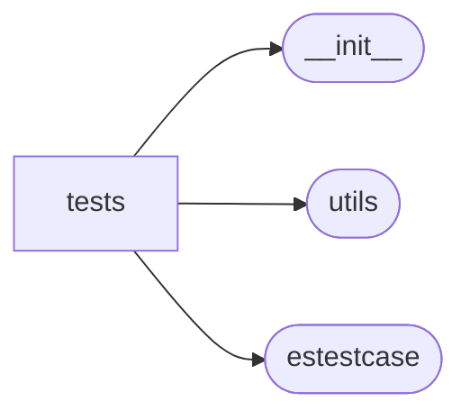

# Elasticutils Tests

[_Documentation generated by Documatic_](https://www.documatic.com)

<!---Documatic-section-Codebase Structure-start--->
## Codebase Structure

<!---Documatic-block-system_architecture-start--->

<!---Documatic-block-system_architecture-end--->

# #
<!---Documatic-section-Codebase Structure-end--->

<!---Documatic-section-elasticutils.tests.__init__.facet_counts_dict-start--->
## [elasticutils.tests.__init__.facet_counts_dict](6-elasticutils_tests.md#elasticutils.tests.__init__.facet_counts_dict)

<!---Documatic-section-facet_counts_dict-start--->
<!---Documatic-block-elasticutils.tests.__init__.facet_counts_dict-start--->
<details>
	<summary><code>elasticutils.tests.__init__.facet_counts_dict</code> code snippet</summary>

```python
def facet_counts_dict(qs, field):
    return dict(((t['term'], t['count']) for t in qs.facet_counts()[field]))
```
</details>
<!---Documatic-block-elasticutils.tests.__init__.facet_counts_dict-end--->
<!---Documatic-section-facet_counts_dict-end--->

# #
<!---Documatic-section-elasticutils.tests.__init__.facet_counts_dict-end--->

<!---Documatic-section-elasticutils.tests.__init__.require_version-start--->
## [elasticutils.tests.__init__.require_version](6-elasticutils_tests.md#elasticutils.tests.__init__.require_version)

<!---Documatic-section-require_version-start--->
<!---Documatic-block-elasticutils.tests.__init__.require_version-start--->
<details>
	<summary><code>elasticutils.tests.__init__.require_version</code> code snippet</summary>

```python
def require_version(minimum_version):

    def decorated(test):
        """Decorator to only run the test if ES version is greater or
        equal than specified.

        """

        @wraps(test)
        def test_with_version(self):
            """Only run the test if ES version is not less than specified."""
            actual_version = self.get_es().info()['version']['number']
            if LooseVersion(actual_version) >= LooseVersion(minimum_version):
                test(self)
            else:
                raise SkipTest
        return test_with_version
    return decorated
```
</details>
<!---Documatic-block-elasticutils.tests.__init__.require_version-end--->
<!---Documatic-section-require_version-end--->

# #
<!---Documatic-section-elasticutils.tests.__init__.require_version-end--->

[_Documentation generated by Documatic_](https://www.documatic.com)